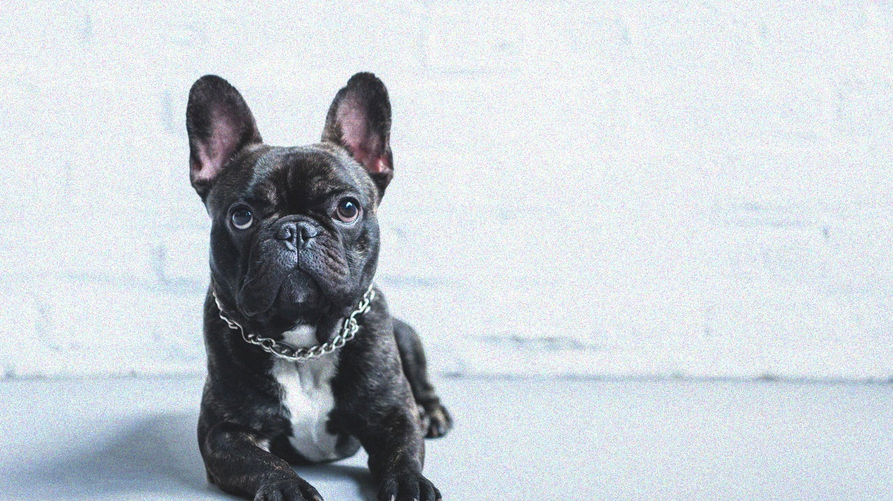
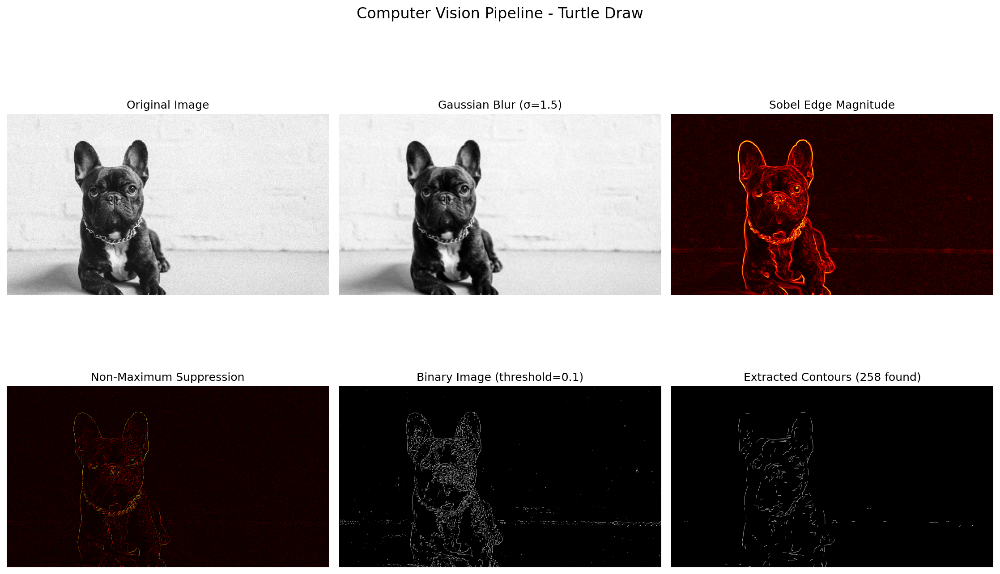
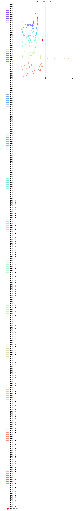
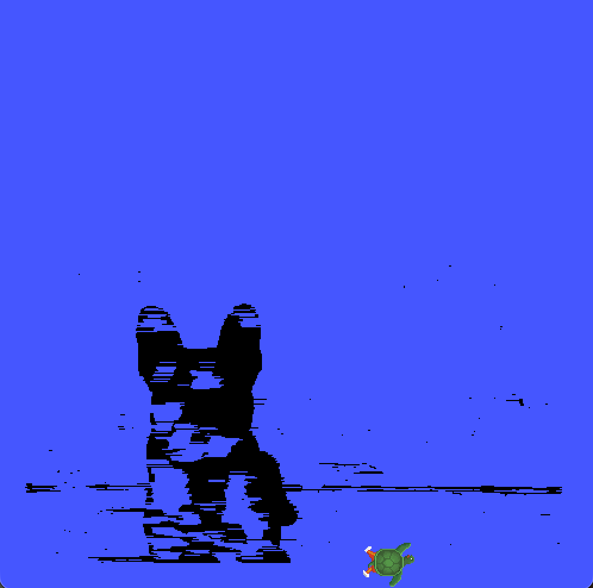

# Turtle Draw: Desenhando com Robô a partir de uma Imagem

Uma pipeline completa de visão computacional implementada do zero para extrair contornos de imagens e controlar a tartaruga do turtlesim para reproduzi-los.

## 🎬 Vídeo Demonstração

[](https://youtu.be/hSWZG_sTzzU)

**Duração:** ~4 minutos  
**Conteúdo:** Explicação da pipeline de visão computacional e código implementado.

---

## 📊 Exemplo: Desenhando um Cachorro

### Imagem Original


### Pipeline de Processamento
A imagem passa por 6 etapas de processamento:



**Etapas mostradas:**
1. **Original** - Imagem em escala de cinza
2. **Gaussian Blur** - Suavização para reduzir ruído (σ=1.5)
3. **Sobel Edge Magnitude** - Detecção de bordas com operadores Sobel
4. **Non-Maximum Suppression** - Afinamento das bordas detectadas
5. **Binary Image** - Imagem binária após thresholding
6. **Extracted Contours** - Contornos finais extraídos

### Planejamento de Caminho
Os contornos são mapeados para o espaço do Turtlesim (0-11 x 0-11):



### Resultado Final: Tartaruga Desenhando


A tartaruga desenhou com sucesso o contorno do cachorro no Turtlesim!

---

## 📋 Requisitos

- **ROS 2** (instalado via micromamba)
- **Python 3.8+**
- **NumPy** (para operações matriciais)
- **OpenCV** (apenas para carregar imagens)
- **Matplotlib** (para visualização)

## 🚀 Setup e Execução

### 1. Ativar Ambiente ROS

```bash
micromamba activate ros_env
```

### 2. Compilar o Pacote ROS

```bash
cd ~/Desktop/ponderada_ros/turtle_draw_ws
colcon build
source install/setup.zsh  # ou setup.bash se usar bash
```

### 3. Iniciar turtlesim (em terminal separado)

```bash
micromamba activate ros_env
ros2 run turtlesim turtlesim_node
```

### 4. Executar a Pipeline

#### Opção A: Visualizar Pipeline (recomendado primeiro)

Visualiza cada etapa do processamento de imagem antes de desenhar:

```bash
source ~/Desktop/ponderada_ros/turtle_draw_ws/install/setup.zsh
cd ~/Desktop/ponderada_ros/turtle_draw_ws/src/turtle_draw_pkg
ros2 run turtle_draw_pkg vision_pipeline dog.png
```

Gera:
- `pipeline_visualization.png` - Mostra: imagem original, blur, detecção de bordas, supressão não-máxima, imagem binária, contornos extraídos
- `turtle_paths.png` - Mostra o espaço de desenho do turtle com os caminhos planejados

#### Opção B: Desenhar com Turtle

Processa a imagem e controla a tartaruga para desenhar os contornos:

```bash
source ~/Desktop/ponderada_ros/turtle_draw_ws/install/setup.zsh
cd ~/Desktop/ponderada_ros/turtle_draw_ws/src/turtle_draw_pkg
ros2 run turtle_draw_pkg turtle_drawer dog.png
```

ou com caminho completo:

```bash
ros2 run turtle_draw_pkg turtle_drawer /Users/guilhermeholanda/Desktop/ponderada_ros/dog.png
```

## 🏗️ Arquitetura da Solução

### Módulos Implementados

#### 1. **image_processor.py**
Toda a pipeline de visão computacional do zero (sem OpenCV para processamento):

- **Gaussian Blur**: Implementação de convolução separável com kernel Gaussiano 1D
  - Reduz ruído mantendo bordas relevantes
  - σ = 1.5 para equilíbrio entre suavização e preservação

- **Sobel Edge Detection**: Operadores Sobel X e Y
  - Detecta gradientes em ambas direções
  - Calcula magnitude e direção do gradiente

- **Non-Maximum Suppression**: Afinamento de bordas
  - Suprime pixels que não são máximos locais
  - Baseado na direção do gradiente local
  - Resultado: bordas com 1 pixel de espessura

- **Thresholding**: Binarização de imagem
  - Converte para preto e branco
  - Threshold adaptativo baseado em percentil

**Algoritmo chave de Sobel:**
```
Gx = [[-1  0  1]     Gy = [[-1 -2 -1]
      [-2  0  2]           [ 0  0  0]
      [-1  0  1]]          [ 1  2  1]]

magnitude = sqrt(Gx² + Gy²)
```

#### 2. **turtle_drawer.py**
Nó ROS 2 que controla a tartaruga:

- **Extração de Pontos**: Encontra todos os pixels brancos na imagem binária
- **Mapeamento**: Transforma coordenadas de imagem para espaço turtle (0-11)
- **Teleportação**: Usa serviço `/turtle1/teleport_absolute` para mover a tartaruga
- **Controle de Caneta**: Usa serviço `/turtle1/set_pen` para levantar/abaixar
- **Detecção de Saltos**: Se distância > 0.3, levanta caneta antes de pular

**Estratégia de desenho:**
```python
for cada ponto:
    if distancia_para_ponto_anterior > threshold:
        levantar_caneta()
        teleportar(ponto)
        abaixar_caneta()
    else:
        teleportar(ponto)  # desenha contínuo
```

#### 3. **vision_pipeline.py**
Ferramenta de visualização e debug:

- Mostra resultado de cada etapa do processamento
- Gera gráficos informativos
- Facilita ajuste de parâmetros

---

## 🔧 Ajustes de Parâmetros

### image_processor.py
```python
# Em preprocess():
gaussian_blur(..., kernel_size=5, sigma=1.5)  # Tamanho e força do blur
threshold(normalized_mag, threshold_value=0.1)  # Sensibilidade
```

### turtle_drawer.py
```python
jump_threshold = 0.3  # Distância mínima para levantar caneta
margin = 0.5  # Margem no espaço turtle
scale = ...  # Escala automática para caber na tela
```

---

## 📚 Exemplos de Uso

### Com imagens diferentes

```bash
# Cachorro (exemplo do projeto)
ros2 run turtle_draw_pkg turtle_drawer ~/Desktop/ponderada_ros/dog.png

# Formas simples de teste
ros2 run turtle_draw_pkg turtle_drawer test_shapes.png

# Sua própria imagem
ros2 run turtle_draw_pkg turtle_drawer /path/to/your/image.png
```

---

## 🐛 Troubleshooting

### "command not found: ros2"
```bash
micromamba activate ros_env
source ~/Desktop/ponderada_ros/turtle_draw_ws/install/setup.zsh
```

### "Could not load image"
- Verifique o caminho absoluto da imagem
- Formatos suportados: PNG, JPG, BMP, etc

### Turtle não se move
- Verifique se turtlesim está rodando: `ros2 topic list` deve mostrar `/turtle1/pose`

### Contornos não são detectados / desenho estranho
- Ajuste `threshold_value` em `image_processor.py`
- Experimente diferentes valores de sigma para o Gaussian blur
- Use `vision_pipeline` para debugar cada etapa

### Performance lenta
- Reduza o tamanho da imagem (redimensione antes de passar)
- O processamento é linear na quantidade de pixels brancos

---

## 📝 Documentação Técnica

Veja [RELATORIO.md](RELATORIO.md) para:
- Decisões de implementação de cada etapa
- Justificativas dos algoritmos escolhidos
- Dificuldades encontradas e soluções
- Análise de desempenho

---

## 📄 Licença

Apache 2.0

## 👤 Autor

Guilherme Hollanda  
guilherme.marques@sou.inteli.edu.br

## 🔗 Referências

- ROS 2 Documentation: https://docs.ros.org/en/humble/
- NumPy Documentation: https://numpy.org/doc/
- Algoritmos implementados:
  - Sobel edge detection
  - Gaussian blur com convolução separável
  - Non-maximum suppression
  - Thresholding
  - Mapeamento de coordenadas

---

## ✨ Destaques do Projeto

✅ **Pipeline de Visão Computacional DO ZERO**
- Sem OpenCV para processamento (apenas NumPy)
- Todos os algoritmos implementados manualmente
- Educacional e documentado

✅ **Integração com ROS 2**
- Nó cliente de serviços
- Comunicação síncrona com Turtlesim
- Controle preciso de movimento

✅ **Visualização Completa**
- Cada etapa da pipeline pode ser visualizada
- Debug facilitado
- Imagens geradas para análise

✅ **Robusto e Flexível**
- Funciona com qualquer imagem
- Escala automática
- Detecção de saltos para desenhos desconexos
